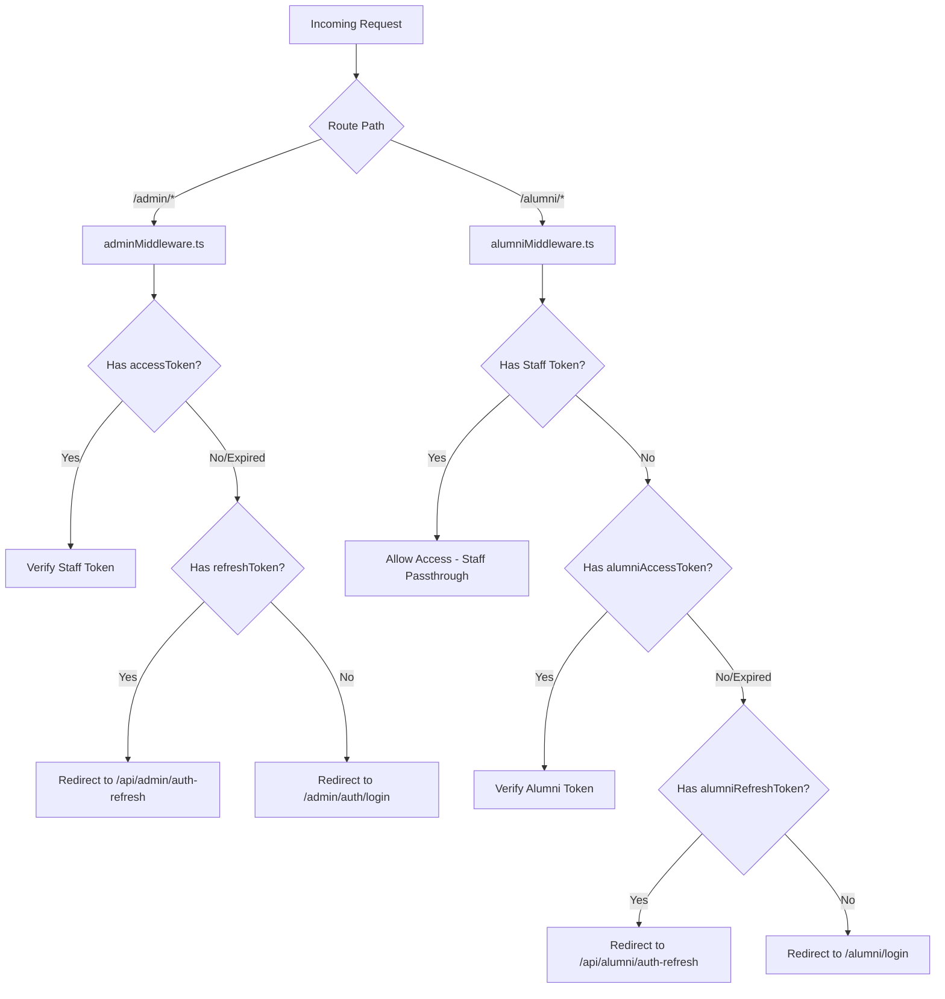

# Alumni Connect Security & Access Control List (ACL) Guide

This document defines the persona profiles, access control lists (ACLs), authentication flows, and campus scoping mechanisms of the Alumni Connect Portal. It serves as the primary security specification and reference guide for development agents.

---

## 1. User Persona Profiles & Roles

The system operates on four main user personas, divided into staff-level administrators and application-level users.

### A. Staff Roles (Administrative Control)
Defined in [schema.prisma:L14-L18](file://prisma/schema.prisma#L14-L18):
```prisma
enum StaffRole {
  ADMIN
  SUB_ADMIN
  COORDINATOR
}
```

#### 1. Super Admin (`StaffRole.ADMIN`)
- **Privilege Level**: Global Administrator.
- **Campus Scope**: Universal. Bypasses all campus restrictions; can filter by any campus or perform actions globally.
- **Module Restriction**: None. Has access to all administrative modules.
- **Responsibilities**: Creates and manages `SUB_ADMIN` accounts, registers/updates campuses, and accesses global system statistics.

#### 2. Sub-Admin / Campus Manager (`StaffRole.SUB_ADMIN`)
- **Privilege Level**: Campus-scoped Administrator.
- **Campus Scope**: Strict. Locked to their assigned `campusId`.
- **Module Restriction**: Controlled by a JSON array of strings in the `modules` field of the `Staff` table:
  - Default modules: `dashboard`, `import`, `alumni`, `jobs`, `events`, `startups`, `requests`, `community`.
- **Responsibilities**: Manages campus-specific alumni, processes registration requests, creates campus events/opportunities, and imports alumni records.

#### 3. Coordinator (`StaffRole.COORDINATOR`)
- **Privilege Level**: Campus-scoped support role.
- **Campus Scope**: Locked to their assigned `campusId`.
- **Responsibilities**: Shares campus-scope permissions but possesses fewer structural modification rights compared to Sub-Admins.

---

### B. Application Users (End-Users)

#### 4. Alumni (`Alumni` Model)
Defined in [schema.prisma:L174-L278](file://prisma/schema.prisma#L174-L278).
- **Privilege Level**: Standard user.
- **Campus Scope**: Belongs to one specific `campusId`.
- **Responsibilities**: Can view/create posts, RSVP to events, view jobs, list startups, join campus communities, and manage their own profiles.
- **Access Scope**: Standard alumni can view posts and opportunities globally, but communities are scoped by campus context.

---

## 2. Authentication & Authorization Mechanics

Authentication is cookie-based using JSON Web Tokens (JWT) for two distinct user pools (Staff and Alumni).



### Key Auth Files:
- **Staff Auth Helpers**: [staff-auth.ts](file://src/lib/auth/staff-auth.ts) resolves staff details (`getAuthenticatedStaff`) and campus-scoping (`resolveCampusScope`).
- **Alumni Auth Helpers**: [getCurrentAlumni.ts](file://src/lib/auth/getCurrentAlumni.ts) fetches current alumni identity (`getCurrentAlumni` & `getCurrentAlumniOrStaff`).
- **Middlewares**:
  - [adminMiddleware.ts](file://src/middlewares/adminMiddleware.ts) secures administrative routes.
  - [alumniMiddleware.ts](file://src/middlewares/alumniMiddleware.ts) secures alumni client portal routes.

---

## 3. Campus Scoping Rules

Campus-scoping restricts a Sub-Admin or Coordinator from editing or accessing resources belonging to another campus.

### How Campus Scope is Resolved in Code:
Defined in `resolveCampusScope` inside [staff-auth.ts](file://src/lib/auth/staff-auth.ts#L29-L43):
- For `ADMIN` (Super Admin): returns the requested campus ID parameter (or `null` for all).
- For `SUB_ADMIN` / `COORDINATOR`: returns the staff's assigned `campusId`.

#### Prisma Scoping Queries:
- **Alumni queries**: `alumniCampusWhere(campusId)` returns `{ campusId }` or `{}` if global.
- **Invitation batches**: `batchCampusWhere(campusId)` ensures batches target the corresponding campus.
- **Invitation batch verification**: `assertBatchCampusAccess` returns `true` if the batch has alumni belonging to the scoped campus.

---

## 4. API Route Audit: Security & Scoping Assessment

Below is a detailed analysis of audited routes, highlighting fully secured paths and critical security gaps.

### A. Fully Secured Routes
These routes enforce proper authentication, role check, module permission check, and campus scoping (where applicable).

1. **Alumni Management**:
   - `GET` [/api/admin/alumni](file://src/app/api/admin/alumni/route.ts): Enforces `alumni` module permission and filters by resolved campus scope.
   - `PUT`/`DELETE` [/api/admin/alumni/[id]](file://src/app/api/admin/alumni/[id]/route.ts): Checks that the edited/deleted alumni belongs to the sub-admin's assigned campus.
2. **Registration Requests Approval/Rejection**:
   - `POST` [/api/admin/registration-requests/[requestId]/approve](file://src/app/api/admin/registration-requests/[requestId]/approve/route.ts) & [/api/admin/registration-requests/[requestId]/reject](file://src/app/api/admin/registration-requests/[requestId]/reject/route.ts): Correctly limits sub-admins to approving/rejecting requests within their own campus.
3. **Startups Module**:
   - `GET`/`DELETE` [/api/admin/startups](file://src/app/api/admin/startups/route.ts): Ensures sub-admins only read and delete startups whose founders belong to the same campus.
4. **Data Normalization**:
   - [/api/admin/normalize/...](file://src/app/api/admin/normalize/stats/route.ts): Restricted to `ADMIN` (Super Admin) only.

---

### B. Security Gaps & Missing Scoping Checks 🚨
The following routes have missing authentication checks or bypass campus-scoping limitations:

#### 1. Critical: Community Management Routes
- **`POST` [/api/communities](file://src/app/api/communities/route.ts)**:
  - **Vulnerability**: Lacks `if (!staff)` verification. Unauthenticated users can POST and create campus communities.
- **`DELETE` [/api/communities/[communityId]](file://src/app/api/communities/[communityId]/route.ts)**:
  - **Vulnerability**: Completely unauthenticated. Anyone can delete any campus community by hitting this endpoint.
- **`POST`/`DELETE` [/api/communities/[communityId]/members](file://src/app/api/communities/[communityId]/members/route.ts)**:
  - **Vulnerability**: Unauthenticated. Anonymous users can join any community, elevate their role to `LEADER`, or remove members.

#### 2. Administrative Scope Vulnerabilities
- **Events Detail (`PUT` / `DELETE` on [/api/admin/events/[id]](file://src/app/api/admin/events/[id]/route.ts))**:
  - **Vulnerability**: Only verifies that the staff member has the `events` module permission. Does NOT check if the event belongs to the sub-admin's campus.
- **Server Actions for Opportunities / Jobs ([jobs.ts](file://src/actions/jobs.ts))**:
  - **Vulnerability**:
    - `toggleAdminJobStatusAction` / `deleteJobAction`: Allows a Sub-Admin to toggle status or delete jobs belonging to other campuses.
    - `getJobApplicantsExportDataAction`: Sub-Admins can download applicant Excel sheets for jobs outside their campus scope.
- **Registration Requests Info**:
  - **`GET` [/api/admin/registration-requests/[requestId]](file://src/app/api/admin/registration-requests/[requestId]/route.ts)**:
    - **Vulnerability**: Unauthenticated. Returns registration request and reviewer data to any requester.

---

## 5. Guidelines for Subagents

When implementing fixes or adding features:
1. **Never Trust the Request Body**: Always resolve `campusId` from the authenticated staff member's session for any write/modify operations unless role is `ADMIN`.
2. **Community Authorization**: Ensure `isLeaderOrAdmin` checks both staff role type and alumni community leader tags.
3. **Assert Ownership/Scope**: When editing/deleting resources (Events, Jobs, Communities, Alumni), always load the target record and verify its campus context against the current staff's resolved campus scope.
