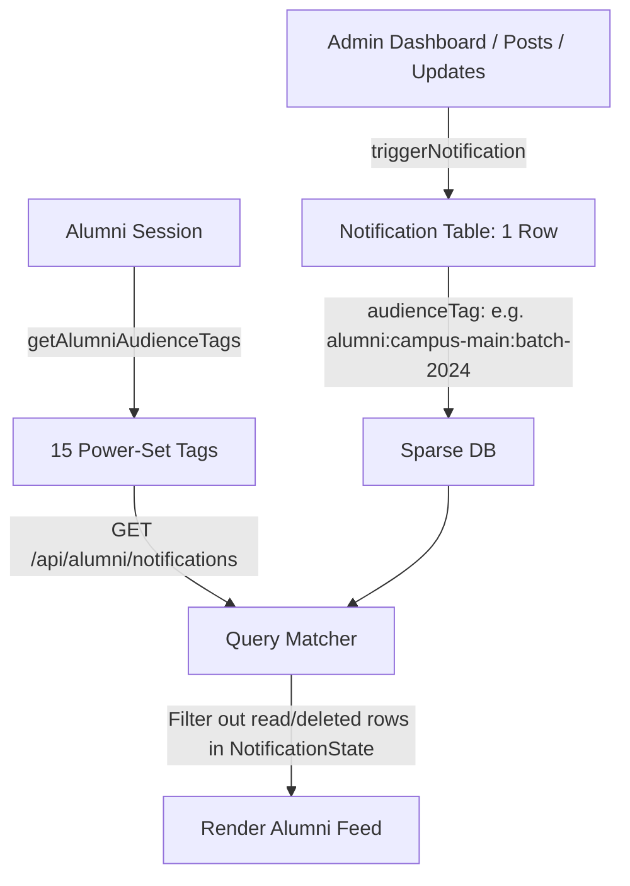

# System Architecture & Migration Guide: Unified Sparse Notifications

This document outlines the architecture, database schema, targeting algorithm, migration mechanics, and operational guides for the unified sparse notification system.

---

## 1. System Architecture

Previously, this portal used a **dense replication model (unicast)** where every broadcast announcement created individual rows for every targeted alumnus. For a cohort of 5,000 users, this meant inserting 5,000 identical rows, resulting in database bloat and performance degradation.

We have replaced this with a **sparse, topic-based query model**:
- **Single-Source Broadcasts**: Broadcast notifications are written exactly **once** (or fanned out to a maximum of $N$ rows for multi-year batch targets) in the `Notification` table.
- **Dynamic Tag Resolution**: When an alumnus opens their feed, the system generates a list of qualifying **audience tags** for that user on the fly based on their profile coordinates (`campus`, `course`, `branch`, `batch`).
- **Sparse State Tracking**: The database only stores rows in `NotificationState` when a user interacts with a notification (marking it read or deleting it). Unread feeds are evaluated dynamically by finding notifications matching the user's tags that do not have a read/delete state.



---

## 2. Dynamic Tag Targeting Algorithm

We target alumni by combining their academic coordinates into colon-delimited string tags. To support sibling optional filtering (where an admin can select any subset of filters independently), we generate the **power-set** of the matching dimensions.

### 4-Dimension Scope (15-Tag Model)
The system uses 4 targeting dimensions:
```typescript
const DIM_ORDER = ['campus', 'course', 'branch', 'batch'] as const;
```
For any given alumnus, we calculate $2^4 - 1 = 15$ combinations of these traits. For example, an alumnus with:
- **Campus**: Main (`main`)
- **Course**: B.Tech (`b-tech`)
- **Branch**: Computer Science (`cse`)
- **Batch**: 2024 (`2024`)

Qualifies for the following audience tags (plus their private `user:{id}` and global `alumni:all` tags):
```
alumni:campus-main
alumni:course-b-tech
alumni:branch-cse
alumni:batch-2024
alumni:campus-main:course-b-tech
alumni:campus-main:branch-cse
alumni:campus-main:batch-2024
alumni:course-b-tech:branch-cse
alumni:course-b-tech:batch-2024
alumni:branch-cse:batch-2024
alumni:campus-main:course-b-tech:branch-cse
alumni:campus-main:course-b-tech:batch-2024
alumni:campus-main:branch-cse:batch-2024
alumni:course-b-tech:branch-cse:batch-2024
alumni:campus-main:course-b-tech:branch-cse:batch-2024
```

When an admin targets "Main Campus + CSE + Batch 2024", the system creates a single notification with the tag `alumni:campus-main:branch-cse:batch-2024`. This matches the alumnus's resolved tags perfectly.

---

## 3. Database Migration Order-of-Operations

> [!CAUTION]
> ### CRITICAL DEPLOYMENT CONSTRAINT
> You **MUST** run the migration script **BEFORE** running `npx prisma db push` or `prisma migrate dev` on production databases.

### Why the Order Matters
1. **Preventing Data Loss**: In the new schema, the `NotificationCampaign` table is removed. If you run `prisma db push` first, Prisma will detect that the model has been deleted and will immediately **DROP** the `notification_campaigns` table, permanently erasing all broadcast campaign history.
2. **Foreign Key Renaming Blocks**: The database has foreign key constraints on the old `notifications` table linking to the `alumni` and `staff` tables. Swapping or dropping the old tables requires dropping these foreign keys first, which Prisma cannot do atomically while renaming tables.

### Safe Migration Lifecycle
To migrate safely on a new git checkout, run these steps in order:

```bash
# STEP 1: Run the migration script to extract, transform, swap, and cleanup tables
npx tsx scripts/migrate-notifications.ts

# STEP 2: Rebuild the Prisma Client
npx prisma generate

# STEP 3: Align indexes and clean up remaining database discrepancies
npx prisma db push
```

### How the Migration Script Works
1. **Dynamic Detection**: Checks if the database table `notifications` contains the `audienceTag` column.
   - If `audienceTag` exists but the newer `campaignGroupId` column is missing, it dynamically runs `ALTER TABLE` to inject the column without running the full migration again.
   - If neither exists, it runs the full zero-downtime migration.
2. **Shadow Table Seeding**: Creates temporary shadow tables `notifications_v2` and `notification_states_v2`.
3. **Unicast Copying**: Copies personal notifications in chunks of 5,000.
4. **Broadcast Explosion**: Reads the old `notification_campaigns` filters, explodes batch year ranges into single years, generates the new canonical tags, and inserts the consolidated broadcast records.
5. **Constraint Pruning**: Dynamically queries the database schema to discover and drop old foreign key constraint names on the `notifications` table.
6. **Atomic Rename Swap**: Swaps the tables using `RENAME TABLE` in a single query, ensuring zero downtime.

---

## 4. Scaling and Future Growth

If you need to extend targeting capabilities or add new filters in the future (e.g., adding `department` or `degree` as a targeting parameter), follow this workflow:

### 1. Update `DIM_ORDER` in `tags.ts`
Add the new dimension name to the array. Order determines the tag string segments order:
```typescript
const DIM_ORDER = ['campus', 'course', 'branch', 'batch', 'department'] as const;
```

### 2. Calculate the Tag Cap
Adding a 5th dimension increases the resolved tags per user from $2^4 - 1 = 15$ to $2^5 - 1 = 31$. 
- Up to 5 dimensions ($31$ tags) is extremely fast for database indexing and fits within the `audienceTag` varchar limit.
- If you exceed 5 dimensions, implement a **depth cap** (e.g. capping combination generation at depth 3) to prevent the power-set size from growing exponentially ($2^N$).

### 3. Update the Target Mappers
Update `generateCampaignTags` and `getAlumniAudienceTags` to map the new field values to the slugified string builders.

### 4. Deploy Schema Alterations
If the new targeting property is stored on the `Alumni` model, add it to `prisma/schema.prisma` and run `npx prisma db push`.
